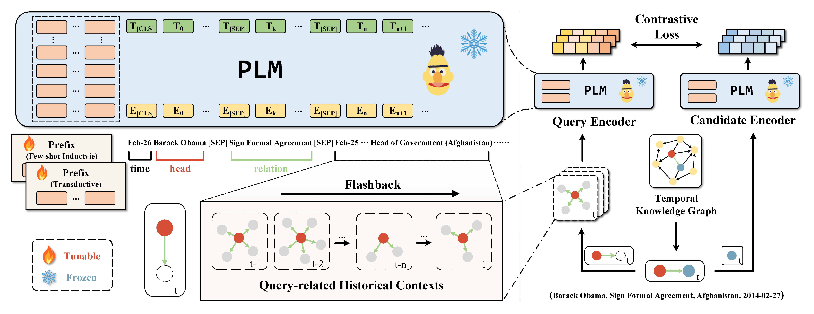

<h1 align="center">
    ChapTER
</h1>
<h3 align="center">
    Deja vu: Contrastive Historical Modeling with Prefix-tuning for Temporal Knowledge Graph Reasoning
</h3>

Official code repository :bookmark_tabs: for _NAACL 2024 Findings_ paper "Deja vu: Contrastive Historical Modeling with Prefix-tuning for Temporal Knowledge Graph Reasoning".

:link: [Arxiv](https://arxiv.org/abs/2404.00051), [ACL Anthology](https://aclanthology.org/2024.findings-naacl.75/)



## Requirements

* python>=3.7
* torch>=1.6
* transformers>=4.15

All experiments are run with GeForce RTX 3090 GPUs.

## How to Run
We provide codes and instructions for running transductive TKG reasoning experiments.

Total 3 steps to follow: dataset preprocessing, model training, and model evaluation.

Datasets used in this repository are list in the directory ``$REPO_DIR/data``. Besides, we've preprocessed the datasets, so you can skip step 1 (unless you want to preprocess your own datasets), directly run the training and evaluation scripts.


### Running Steps
Taking ICEWS14 dataset as an example:

Step 1, preprocess the dataset
```
bash scripts/preprocess.sh ICEWS14
```

Step 2, training the model
```
CUDA_VISIBLE_DEVICES=0,1,2 OUTPUT_DIR=./checkpoint/ICEWS14/ bash scripts/train_icews14.sh
```

Step 3, evaluate the model
```
CUDA_VISIBLE_DEVICES=0 bash scripts/eval.sh ./checkpoint/ICEWS14/model_last.mdl ICEWS14
```

The trained model checkpoints and output files are saved in directory ``$REPO_DIR/checkpoint``.

Note: For custom dataset, replace ``ICEWS14`` to any dataset name that you want to run.

## Citation
If you use our code in your research, please cite our work:
```
@inproceedings{peng2024deja,
  title={Deja vu: Contrastive Historical Modeling with Prefix-tuning for Temporal Knowledge Graph Reasoning},
  author={Peng, Miao and Liu, Ben and Xu, Wenjie and Jiang, Zihao and Zhu, Jiahui and Peng, Min},
  booktitle={Findings of the Association for Computational Linguistics: NAACL 2024},
  pages={1178--1191},
  year={2024}
}
```